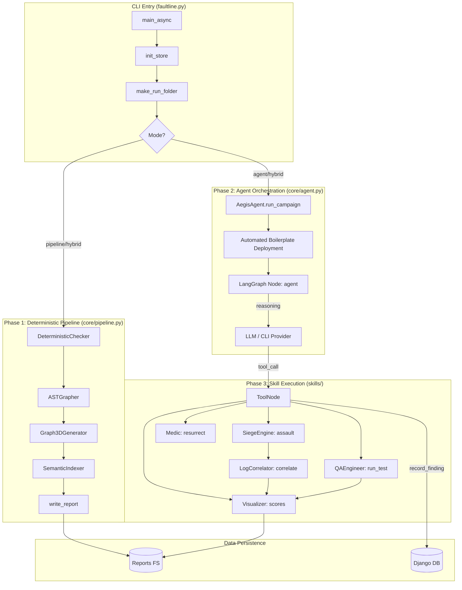

# Faultline: Master Architectural Flow Map (Dry Run)

**Date**: 2026-05-01
**Description**: Technical map of the connectivity between core modules and skills, used for architectural tracing and dead-code identification.

This is the definitive guide to the Faultline **Hybrid Architecture**. It maps the connectivity of every core file and skill. Use this to trace the "Golden Path" of data and identify **Dead Code** (files or functions not mentioned here).

---

## 🗺️ High-Level System Flow (Mermaid)

---

## 📂 File-by-File Connectivity & Importance

### 1. Core Orchestration (`core/`)
*   **`faultline.py` [CRITICAL]**: The entry point. Connects the CLI user to the backend services.
*   **`core/agent.py` [CRITICAL]**: The "Brain." Orchestrates the LangGraph loop. If a tool isn't bound here in `FAULTLINE_TOOLS`, it is effectively **Dead Code**.
*   **`core/pipeline.py` [HIGH]**: The "Gatekeeper." Runs before the agent to provide context.
*   **`core/provider_config.py` & `core/cli_provider.py` [HIGH]**: Manages the delegation to local CLIs (Claude/Gemini/Codex).
*   **`core/context.py` & `core/run_context.py` [HIGH]**: Provides thread-safe storage for session headers and run-specific file paths.
*   **`core/hitl.py` [MEDIUM]**: Manages human intervention. Tools like `execute_chaos_campaign` depend on this for permission.
*   **`core/credential_store.py` [MEDIUM]**: The Vault interface. Supplies tokens to the agent's context.

### 2. Testing & Attack Skills (`skills/`)
*   **`skills/ast_grapher.py` [CRITICAL]**: Maps the attack surface. Its output is fed into the Agent's system prompt via `core/agent.py`.
*   **`skills/qa_engineer.py` [CRITICAL]**: Executes the "Edit-Run" methodology. Connects agent reasoning to real-world functional verification.
*   **`skills/attacker.py` [CRITICAL]**: The chaos engine. Fires the actual payloads.
*   **`skills/log_correlator.py` [HIGH]**: The detective. Watches for crashes during attacks. **If it doesn't find the `X-Aegis-Request-ID`, attribution fails.**
*   **`skills/medic.py` [MEDIUM]**: Application lifecycle. Used by the agent to ensure the target is alive before testing.
*   **`skills/deterministic_checker.py` [MEDIUM]**: Used by `PipelineRunner` to find syntax/import errors before the agent starts.
*   **`skills/visualizer.py` [MEDIUM]**: Synthesizes scores and charts at the end of the campaign.
*   **`skills/semantic_indexer.py` [LOW]**: Powers the `query_knowledge_base` tool. Important for complex projects with heavy documentation.
*   **`skills/guardrails.py` [LOW]**: Safety filter for generated code.

### 3. Backend & Models (`campaigns/` & `vault/`)
*   **`campaigns/models.py` [HIGH]**: Stores findings and campaign status. `core/tools.py -> record_finding` is the primary writer here.
*   **`vault/models.py` [MEDIUM]**: Stores auth flows. Used by `vault/authenticator.py` to acquire credentials.
*   **`campaigns/services.py` [MEDIUM]**: Provides the logic for the REST API endpoints.

---

## 💡 How to Identify Dead Code
1.  **Check `core/tools.py`**: Any function in `skills/` that does not have a corresponding `@tool` in `core/tools.py` (and is not used by `PipelineRunner`) is **Dead Code**.
2.  **Check `core/agent.py`**: Any tool defined in `core/tools.py` but not added to `FAULTLINE_TOOLS` is **Dead Code**.
3.  **Check `PipelineRunner.run()`**: Any skill not called in this method or by the agent is likely a legacy artifact.
